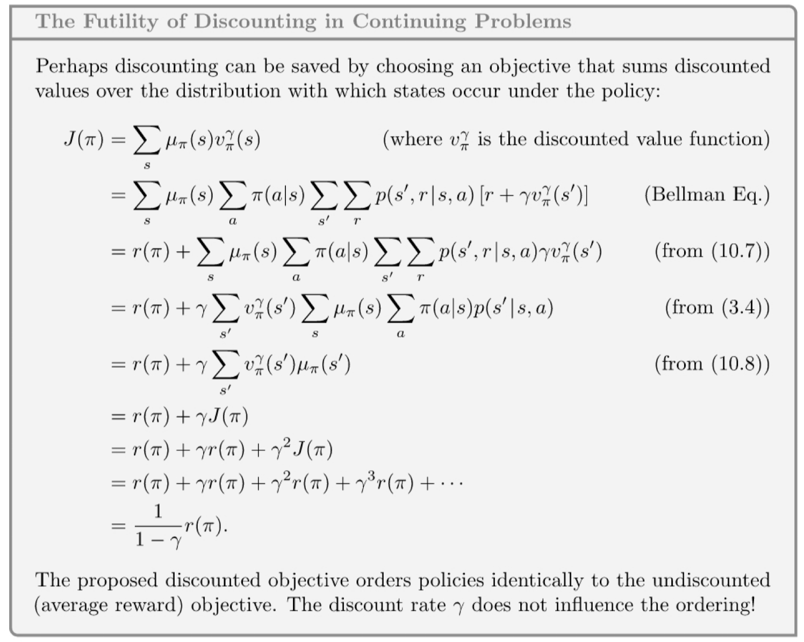

# Barto-Sutton Chap.10 On-policy Control with approximation

Predict problem: Given a policy, calculate the state value function.

* Tabular solution: $s_t \rightarrow V(s_t)$

* Approximate solution: $s_t \rightarrow \hat V(s_t) \approx V(s_t)$
* Samples formation: $S_t \rightarrow U_t$
  * Monte Carlo: $U_t = G_t$
  * TD(0): $U_t = r_t + \gamma \hat V(s_{t+1})$
  * TD($\lambda$): $U_t = G_{t:t+\lambda}$

Control problem: Given a MDP, return the optimal policy.

* Tabular solution: $s_t, a_t \rightarrow Q(s_t, a_t)$
* Approximate solution: $s_t, a_t \rightarrow \hat Q(s_t, a_t) \approx Q(s_t, a_t)$

* Samples formation: $S_t, A_t \rightarrow U_t$

## Episodic Semi-gradient Control

Gerneral gradient-decent update for action values prediction
$$
\overline{V E}(w):=\sum_s \mu(s_t, a_t)\left[Q_\pi(s_t, a_t)-q(s_t,a_t,w)\right]^2 \\
\mathbf{w}_{t+1} \doteq \mathbf{w}_t+\alpha\left[U_t-\hat{q}\left(S_t, A_t, \mathbf{w}_t\right)\right] \nabla \hat{q}\left(S_t, A_t, \mathbf{w}_t\right)
$$
Update for episodic semi-gradient one-step Sarsa
$$
\mathbf{w}_{t+1} \doteq \mathbf{w}_t+\alpha\left[R_{t+1}+\gamma \hat{q}\left(S_{t+1}, A_{t+1}, \mathbf{w}_t\right)-\hat{q}\left(S_t, A_t, \mathbf{w}_t\right)\right] \nabla \hat{q}\left(S_t, A_t, \mathbf{w}_t\right)
$$

## Semi-gradient n-step Sarsa

Using an n-step return as the update target in semi-gradient Sarsa update equation.
$$
G_{t: t+n} \doteq R_{t+1}+\gamma R_{t+2}+\cdots+\gamma^{n-1} R_{t+n}
\quad+\gamma^n \hat{q}\left(S_{t+n}, A_{t+n}, \mathbf{w}_{t+n-1}\right), t+n<T
$$
If $t+n \ge T$, then $G_{t:t+n} \doteq G_t$.

Update equation of the n-step Sarsa
$$
\mathbf{w}_{t+n} \doteq \mathbf{w}_{t+n-1}+\alpha\left[G_{t: t+n}-\hat{q}\left(S_t, A_t, \mathbf{w}_{t+n-1}\right)\right] \nabla \hat{q}\left(S_t, A_t, \mathbf{w}_{t+n-1}\right), 0 \leqslant t<T
$$

An intermediate level of bootstrapping tends to learn faster and better asymptotic performance.

## Average Reward: A New Problem Setting for Continuing Tasks

MDP target setting

* Episodic settings
* Discounted settings
* **Average reward** settings, applies to continuing problems, which the interaction between agent and environment goes on and forever without termination or start states.

### Reason for introducing the average reward<a href="#10:ref2">2</a>

$$
V_L(S)=\frac{1}{1-\gamma^5} \quad V_R(S)=\frac{2 \gamma^4}{1-\gamma^5}
$$
If $\gamma = 0.5$ , $V_L(S)\approx 1$ and $V_R(S)\approx0.1$, then choose the L will obtain more rewards.

If $\gamma = 0.9$ , $V_L(S)\approx 2.4$ and $V_R(S)\approx3.2$, then choose the R will obtain more rewards.

Let $V_L(S) < V_R(S)$, then $\gamma > 2^{-\frac{1}{4}} \approx 0.841$.

If there are 99 states, then $\gamma > 2^{-\frac{1}{99}} \approx 0.993$.

### Average reward

In the average-reward setting, the quality of a policy $\pi$ is defined as the average rate of reward, which denote as $r(\pi)$.
$$
\begin{aligned}
r(\pi) & \doteq \lim _{h \rightarrow \infty} \frac{1}{h} \sum_{t=1}^h \mathbb{E}\left[R_t \mid S_0, A_{0: t-1} \sim \pi\right] \\
& =\lim _{t \rightarrow \infty} \mathbb{E}\left[R_t \mid S_0, A_{0: t-1} \sim \pi\right] \\
& =\sum_s \mu_\pi(s) \sum_a \pi(a \mid s) \sum_{s^{\prime}, r} p\left(s^{\prime}, r \mid s, a\right) r
\end{aligned}
$$
**MDP's ergodicity:** $\mu_\pi$ is  the steady-state distribution,
$$
\mu_\pi(s) \doteq \lim _{t \rightarrow \infty} \operatorname{Pr}\left\{S_t=s \mid A_{0: t-1} \sim \pi\right\}
$$
, which is assumed to exist for any $\pi$ and to be independent of $S_0$.

**Steady-state distribution:** $$
\sum_s \mu_\pi(s) \sum_a \pi(a \mid s) p\left(s^{\prime} \mid s, a\right)=\mu_\pi\left(s^{\prime}\right)$$

**Return in average reward setting:** $G_t \doteq R_{t+1}-r(\pi)+R_{t+2}-r(\pi)+R_{t+3}-r(\pi)+\cdots$, which called *differential return*, and the corresponding value functions called *differential value functions*.

* **Value function**
  $$
   \begin{aligned}
    v_\pi(s) \doteq & \mathbb{E}_\pi\left[G_t \mid S_t=s\right] \\
    q_\pi(s, a) \doteq & \mathbb{E}_\pi\left[G_t \mid S_t=s, A_t=a\right]
    \end{aligned}
  $$

* **Bellman equation**
  $$
  \begin{aligned}
  v_\pi(s)=&\sum_a \pi(a \mid s) \sum_{r, s^{\prime}} p\left(s^{\prime}, r \mid s, a\right)\left[r-r(\pi)+v_\pi\left(s^{\prime}\right)\right] \\
  q_\pi(s, a)=&\sum_{r, s^{\prime}} p\left(s^{\prime}, r \mid s, a\right)\left[r-r(\pi)+\sum_{a^{\prime}} \pi\left(a^{\prime} \mid s^{\prime}\right) q_\pi\left(s^{\prime}, a^{\prime}\right)\right] \\
  v_*(s)=&\max _a \sum_{r, s^{\prime}} p\left(s^{\prime}, r \mid s, a\right)\left[r-\max _\pi r(\pi)+v_*\left(s^{\prime}\right)\right]  \\
  q_*(s, a)=&\sum_{r, s^{\prime}} p\left(s^{\prime}, r \mid s, a\right)\left[r-\max _\pi r(\pi)+\max _{a^{\prime}} q_*\left(s^{\prime}, a^{\prime}\right)\right]
  \end{aligned}
  $$

* **TD errors**
  $$
  \begin{aligned}
    \delta_t \doteq & R_{t+1}-\bar{R}_t+\hat{v}\left(S_{t+1}, \mathbf{w}_t\right)-\hat{v}\left(S_t, \mathbf{w}_t\right) \\
    \delta_t \doteq & R_{t+1}-\bar{R}_t+\hat{q}\left(S_{t+1}, A_{t+1}, \mathbf{w}_t\right)-\hat{q}\left(S_t, A_t, \mathbf{w}_t\right)
  \end{aligned}
  $$

## Deprecating the Discounted Setting

**Main idea:** The discount rate $\gamma$ thus has no effect on the average reward setting. It could be *zero* and the ranking of policy would be unchanged.

**Simple explanation:** Every reward has the same weight $1+\gamma+\gamma^2+\gamma^3+\cdots=1 /(1-\gamma)$.

**Detail proof:**

The root cause of the difficulties with the discounted control setting is that with function approximation we have lost the policy improvement theorem(Section 4.2).

<!-- ==为何会不保证？== -->

## Differential Semi-gradient n-step Sarsa

Differential form of the n-step return:
$$
G_{t: t+n} \doteq R_{t+1}-\bar{R}_{t+1}+\cdots+R_{t+n}-\bar{R}_{t+n-1}+\hat{q}\left(S_{t+n}, A_{t+n}, \mathbf{w}_{t+n-1}\right)
$$
The n-step TD error is then
$$
\delta_t \doteq G_{t: t+n}-\hat{q}\left(S_t, A_t, \mathbf{w}\right)
$$

## Summary

1. Extend approximation and semi-gradient to control problem for episodic problem.
2. For continuing problem, introducing a new problem setting, which called average reward setting.
3. Discounted cause no effect on approximation.

## Reference

1. https://www.zhihu.com/people/S.Chris.Lin/posts

2. https://blog.nex3z.com/2019/11/09/rl-notes-average-reward/
