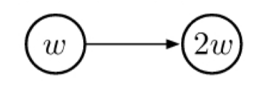
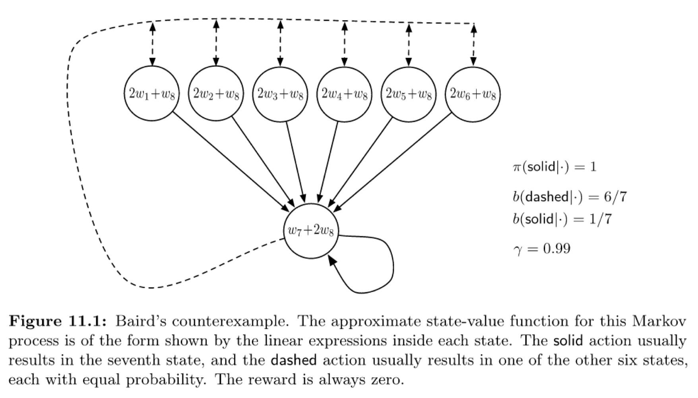
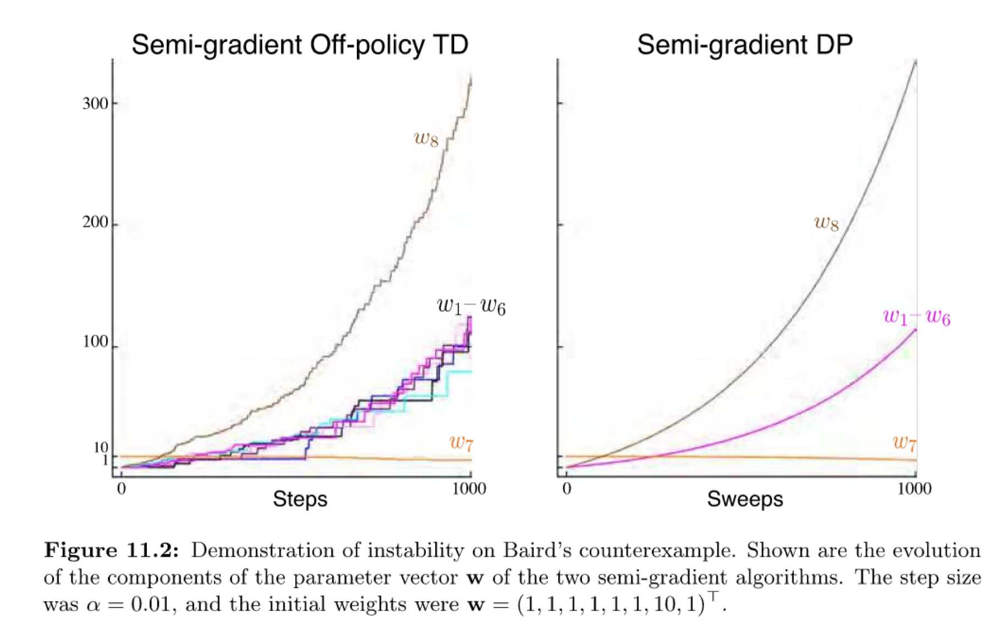
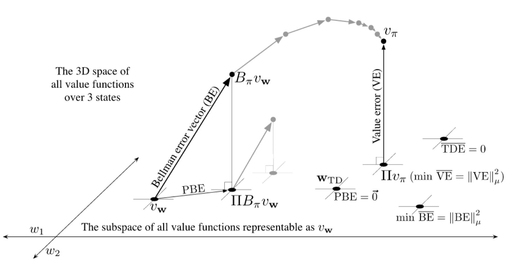
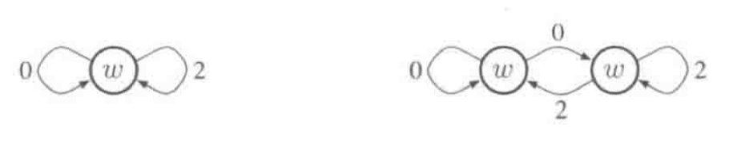
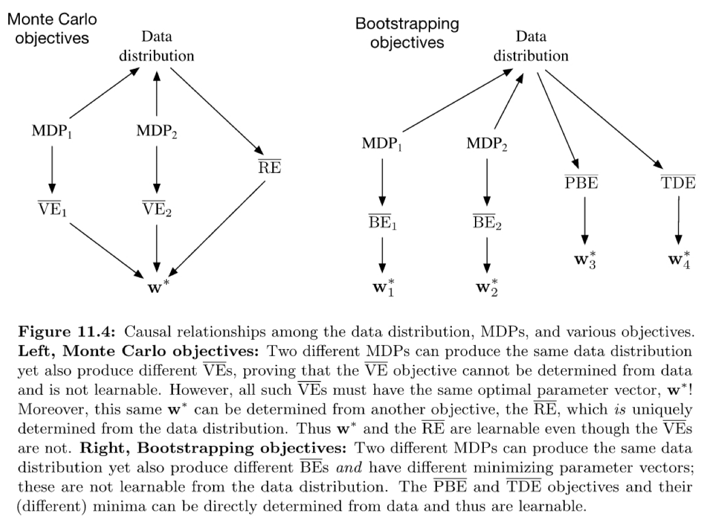
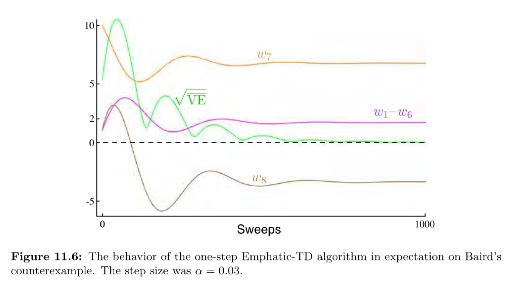

# Barto-Sutton Chap.11 Off-policy Methods with Approximation

The challenge of off-policy learning:

* The target of the updates *(not to be confuse with the target policy)*
  * Importance sampling *(may increase variance)*
* The distribution of the updates
  * Importance sampling
  * Develop the true gradient methods that don't rely on any special distribution for stability

<!-- more -->
## Semi-gradient Methods

**Importance sampling:** $\rho_t \doteq \rho_{t: t}=\frac{\pi\left(A_t \mid S_t\right)}{b\left(A_t \mid S_t\right)}$

**One step state value function is semi-gradient TD(0) error**
$$
\mathbf{w}_{t+1} \doteq \mathbf{w}_t+\alpha \rho_t \delta_t \nabla \hat{v}\left(S_t, \mathbf{w}_t\right)
$$
where $\delta_t$ depend on whether the problem is episodic and discounted, or continuing and undiscounted using average reward:
$$
\begin{aligned}
\delta_t \doteq & R_{t+1}+\gamma \hat{v}\left(S_{t+1}, \mathbf{w}_t\right)-\hat{v}\left(S_t, \mathbf{w}_t\right) \\
or & \\
\delta_t \doteq & R_{t+1}-\bar{R}_t+\hat{v}\left(S_{t+1}, \mathbf{w}_t\right)-\hat{v}\left(S_t, \mathbf{w}_t\right)
\end{aligned}
$$
**One step action value function is semi-gradient Expected Sarsa**
$$
\begin{aligned}
\mathbf{w}_{t+1} \doteq & \mathbf{w}_t+\alpha \delta_t \nabla \hat{q}\left(S_t, A_t,
\mathbf{w}_t\right) \\
\delta_t \doteq & R_{t+1}+\gamma \sum_a \pi\left(a \mid S_{t+1}\right) \hat{q}\left(S_{t+1}, a, \mathbf{w}_t\right)-\hat{q}\left(S_t, A_t, \mathbf{w}_t\right) \\
or &\\
\delta_t \doteq & R_{t+1}-\bar{R}_t+\sum_a \pi\left(a \mid S_{t+1}\right) \hat{q}\left(S_{t+1}, a, \mathbf{w}_t\right)-\hat{q}\left(S_t, A_t, \mathbf{w}_t\right)
\end{aligned}
$$
Note that the algorithm does not use importance sampling. In the tabular case, it is **appropriate** because the only sample action is $A_t$, and in learing its value we do not have to consider any other actions. With function approximation it is **less clear**.

## Examples of Off-policy Divergence

### A simple example

Suppose there has two states, the feature vectors are all scales, in this case 1 and 2. The following situation occurs under linear function approximation.

TD error:
$$
\delta_t=R_{t+1}+\gamma \hat{v}\left(S_{t+1}, \mathbf{w}_t\right)-\hat{v}\left(S_t, \mathbf{w}_t\right)=0+\gamma 2 w_t-w_t=(2 \gamma-1) w_t
$$
Update of off-policy semi-gradient TD(0):
$$
w_{t+1}=w_t+\alpha \rho_t \delta_t \nabla \hat{v}\left(S_t, w_t\right)=w_t+\alpha \cdot 1 \cdot(2 \gamma-1) w_t \cdot 1=(1+\alpha(2 \gamma-1)) w_t
$$
Note that the importance sampling $\rho_t = 1$.

### A simple complete sample - Baird's counterexample

$$
\mathbf{w}_{k+1} \doteq \mathbf{w}_k+\frac{\alpha}{|\mathcal{S}|} \sum_{\mathbf{s}}\left(\mathbb{E}\left[R_{t+1}+\gamma \hat{v}\left(S_{t+1}, \mathbf{w}_k\right) \mid S_t=s\right]-\hat{v}\left(s, \mathbf{w}_k\right)\right) \nabla \hat{v}\left(s, \mathbf{w}_k\right)
$$

If we apply semi-gradient TD(0) to this problem, then the weights diverge to infinity.

## The Deadly Triad

The danger of instability and divergence arises whenever we combine all the following three elements.

* Function approximation
* Bootstrapping
* Off-policy training

We can avoid the instability if any two elements of deadly triad are present, but not all three.

Importance: Function approximation $>$ Bootstrapping $>$ Off-policy training

## Linear Value-function Geometry

Given a state space $S=\left\{s_1,s_2,s_3 \right \}$, and two parameters $w=(w_1, w_2)^T$.

* $v_w$: Value function in the subspace

* $v_{\pi}$: The true value function, which is too complex to be represented exactly as an approximation

* $\|v\|_\mu^2 \doteq \sum_{s \in \mathcal{S}} \mu(s) v(s)^2$: The distance between value functions

* $\overline{\mathrm{VE}}(\mathbf{w})=\left\|v_{\mathbf{w}}-v_\pi\right\|_\mu^2$: Mean square value error

* Projection operator: $\Pi v \doteq v_{\mathbf{w}} \quad \text { where } \quad \mathbf{w}=\underset{\mathbf{w} \in \mathbb{R}^d}{\arg \min }\left\|v-v_{\mathbf{w}}\right\|_\mu^2$

* Bellman error **BE**:

$$
\begin{aligned}
  v_\pi(s)&=\sum_a \pi(a \mid s) \sum_{s^{\prime}, r} p\left(s^{\prime}, r \mid s, a\right)\left[r+\gamma v_\pi\left(s^{\prime}\right)\right], \quad \text { for all } s \in \mathcal{S} \\
  \bar{\delta}_{\mathbf{w}}(s) & \doteq\left(\sum_a \pi(a \mid s) \sum_{s^{\prime}, r} p\left(s^{\prime}, r \mid s, a\right)\left[r+\gamma v_{\mathbf{w}}\left(s^{\prime}\right)\right]\right)-v_{\mathbf{w}}(s) \\
  & =\mathbb{E}_\pi\left[R_{t+1}+\gamma v_{\mathbf{w}}\left(S_{t+1}\right)-v_{\mathbf{w}}\left(S_t\right) \mid S_t=s, A_t \sim \pi\right]
\end{aligned}
$$
​		**Conclusion:** The Bellman error is the expectation of the TD error.

* Mean squared Bellman Error: $\overline{\mathrm{BE}}(\mathbf{w})=\left\|\bar{\delta}_{\mathbf{w}}\right\|_\mu^2$

* **min** $\overline {BE}$ usually is different from **min** $\overline{VE}$

* Bellman operator $B_\pi: \mathbb{R}^{|\mathcal{S}|} \rightarrow \mathbb{R}^{|\mathcal{S}|}$

$$
 \left(B_\pi v\right)(s) \doteq \sum_a \pi(a \mid s) \sum_{s^{\prime}, r} p\left(s^{\prime}, r \mid s, a\right)\left[r+\gamma v\left(s^{\prime}\right)\right]
$$
​		 Therefore, $\bar{\delta}_{\mathbf{w}}=B_\pi v_{\mathbf{w}}-v_{\mathbf{w}}$.

​		  The true value fucntion, $v_\pi$, is the unique fixed point for the Bellman operator.
$$
  v_\pi=B_\pi v_\pi
$$
* Mean squared projection Bellman error $\overline{PBE}$:  $\overline{\operatorname{PBE}}(\mathbf{w})=\left\|\Pi \bar{\delta}_{\mathbf{w}}\right\|_\mu^2$

## Gradient Descent in the Bellman Error

The approach of SGD, in which updates are made that in expectation are equal to the **negative gradient** of an objective function. Semi-gradient methods may diverge under off-policy training and contrived cases of nonlinear function apporximation.

People want to use the SGD for reinforcement learning. The starting place is the choice of an error or objective function.

### Minimize TD error

One step TD error with discounting
$$
\delta_t=R_{t+1}+\gamma \hat{v}\left(S_{t+1}, \mathbf{w}_t\right)-\hat{v}\left(S_t, \mathbf{w}_t\right)
$$
Mean squared TD error
$$
\begin{aligned}
 \overline{\mathrm{TDE}}(\mathbf{w})&=\sum_{s \in \mathcal{S}} \mu(s) \mathbb{E}\left[\delta_t^2 \mid S_t=s, A_t \sim \pi\right] \\
& =\sum_{s \in \mathcal{S}} \mu(s) \mathbb{E}\left[\rho_t \delta_t^2 \mid S_t=s, A_t \sim b\right] \\
& =\mathbb{E}_b\left[\rho_t \delta_t^2\right]
\end{aligned}
$$
Updates
$$
\begin{aligned}
\mathbf{w}_{t+1} & =\mathbf{w}_t-\frac{1}{2} \alpha \nabla\left(\rho_t \delta_t^2\right) \\
& =\mathbf{w}_t-\alpha \rho_t \delta_t \nabla \delta_t \\
& =\mathbf{w}_t+\alpha \rho_t \delta_t\left(\nabla \hat{v}\left(S_t, \mathbf{w}_t\right)-\gamma \nabla \hat{v}\left(S_{t+1}, \mathbf{w}_t\right)\right)
\end{aligned}
$$
called **naive residual-gradient algorithm**. Although it converges robustly, it will converge to anthor place.

### Minimize Bellman error

Bellman error is the expectation of the TD error.
$$
\begin{aligned}
\mathbf{w}_{t+1} & =\mathbf{w}_t-\frac{1}{2} \alpha \nabla\left(\mathbb{E}_\pi\left[\delta_t\right]^2\right) \\
& =\mathbf{w}_t-\frac{1}{2} \alpha \nabla\left(\mathbb{E}_b\left[\rho_t \delta_t\right]^2\right) \\
& =\mathbf{w}_t-\alpha \mathbb{E}_b\left[\rho_t \delta_t\right] \nabla \mathbb{E}_b\left[\rho_t \delta_t\right] \\
& =\mathbf{w}_t-\alpha \mathbb{E}_b\left[\rho_t\left(R_{t+1}+\gamma \hat{v}\left(S_{t+1}, \mathbf{w}\right)-\hat{v}\left(S_t, \mathbf{w}\right)\right)\right] \mathbb{E}_b\left[\rho_t \nabla \delta_t\right] \\
& =\mathbf{w}_t+\alpha\left[\mathbb{E}_b\left[\rho_t\left(R_{t+1}+\gamma \hat{v}\left(S_{t+1}, \mathbf{w}\right)\right)\right]-\hat{v}\left(S_t, \mathbf{w}\right)\right]\left[\nabla \hat{v}\left(S_t, \mathbf{w}\right)-\gamma \mathbb{E}_b\left[\rho_t \nabla \hat{v}\left(S_{t+1}, \mathbf{w}\right)\right]\right]
\end{aligned}
$$
called **residual-gradient algorithm.**

Using sample values in all expectations, the equation reduce to naive residual-gradient algorithm.
==???==

Three disadvantages:

* Converge rate is slow
* Converge to wrong value
* It is not learnable

## The Bellman Error is Not Learnable

**Unlearnable:** Even if we have infinite samples, we cannot learn some variables.

**An example:**

We cannot distinguish whether it is one state or two states.

Suppose $\gamma=0$, the state value is 1,0,2 from left to right. If the $w=1$, then $\overline {VE_{left}}=0, \overline {VE_{right}}=1$. The same data distribution, but different VE. So VE is not Learnable.

## Gradient-TD Methods

In order to obtain the SGD method of $\overline {PBE}$, we need to ge the graident of $\overline {PBE}$.
$$
\begin{aligned}
\overline{\operatorname{PBE}}(\mathbf{w}) & =\left\|\Pi \bar{\delta}_{\mathbf{w}}\right\|_\mu^2 \\
& =\left(\Pi \bar{\delta}_{\mathbf{w}}\right)^{\top} \mathbf{D} \Pi \bar{\delta}_{\mathbf{w}} \\
& =\bar{\delta}_{\mathbf{w}}^{\top} \Pi^{\top} \mathbf{D} \Pi \bar{\delta}_{\mathbf{w}} \\
& =\bar{\delta}_{\mathbf{w}}^{\top} \mathbf{D} \mathbf{X}\left(\mathbf{X}^{\top} \mathbf{D} \mathbf{X}\right)^{-1} \mathbf{X}^{\top} \mathbf{D} \bar{\delta}_{\mathbf{w}}\\
&(\text{using (11.14) and the identity }\left.\Pi^{\top} \mathbf{D} \Pi=\mathbf{D X}\left(\mathbf{X}^{\top} \mathbf{D X}\right)^{-1} \mathbf{X}^{\top} \mathbf{D}\right ) \\
& =\left(\mathbf{X}^{\top} \mathbf{D} \bar{\delta}_{\mathbf{w}}\right)^{\top}\left(\mathbf{X}^{\top} \mathbf{D} \mathbf{X}\right)^{-1}\left(\mathbf{X}^{\top} \mathbf{D} \bar{\delta}_{\mathbf{w}}\right)
\end{aligned}
$$
The gradient with respect to $w$ is
$$
\nabla \overline{\mathrm{PBE}}(\mathbf{w})=2 \nabla\left[\mathbf{X}^{\top} \mathbf{D} \bar{\delta}_{\mathbf{w}}\right]^{\top}\left(\mathbf{X}^{\top} \mathbf{D} \mathbf{X}\right)^{-1}\left(\mathbf{X}^{\top} \mathbf{D} \bar{\delta}_{\mathbf{w}}\right)
$$
The last factor
$$
\mathbf{X}^{\top} \mathbf{D} \bar{\delta}_{\mathbf{w}}=\sum_s \mu(s) \mathbf{x}(s) \bar{\delta}_{\mathbf{w}}(s)=\mathbb{E}\left[\rho_t \delta_t \mathbf{x}_t\right]
$$
The first factor
$$
\begin{aligned}
\nabla \mathbb{E}\left[\rho_t \delta_t \mathbf{x}_t\right]^{\top} & =\mathbb{E}\left[\rho_t \nabla \delta_t^{\top} \mathbf{x}_t^{\top}\right] \\
& =\mathbb{E}\left[\rho_t \nabla\left(R_{t+1}+\gamma \mathbf{w}^{\top} \mathbf{x}_{t+1}-\mathbf{w}^{\top} \mathbf{x}_t\right)^{\top} \mathbf{x}_t^{\top}\right] \quad
(\text{Using episodic} \quad \delta _t)
\\
& =\mathbb{E}\left[\rho_t\left(\gamma \mathbf{x}_{t+1}-\mathbf{x}_t\right) \mathbf{x}_t^{\top}\right]
\end{aligned}
$$
The middle factor
$$
\mathbf{X}^{\top} \mathbf{D} \mathbf{X}=\sum_s \mu(s) \mathbf{x}_s \mathbf{x}_s^{\top}=\mathbb{E}\left[\mathbf{x}_t \mathbf{x}_t^{\top}\right]
$$
In summary
$$
\nabla \overline{\mathrm{PBE}}(\mathbf{w})=2 \mathbb{E}\left[\rho_t\left(\gamma \mathbf{x}_{t+1}-\mathbf{x}_t\right) \mathbf{x}_t^{\top}\right] \mathbb{E}\left[\mathbf{x}_t \mathbf{x}_t^{\top}\right]^{-1} \mathbb{E}\left[\rho_t \delta_t \mathbf{x}_t\right]
$$
We represent the product of the last two terms as a vector $v$
$$
\mathbf{v} \approx \mathbb{E}\left[\mathbf{x}_t \mathbf{x}_t^{\top}\right]^{-1} \mathbb{E}\left[\rho_t \delta_t \mathbf{x}_t\right]
$$
$v$ is the solution of the linear problem $v^Tx_t=\rho_t\delta_t$
$$
\mathbf{v}_{t+1} \doteq \mathbf{v}_t+\beta \rho_t\left(\delta_t-\mathbf{v}_t^{\top} \mathbf{x}_t\right) \mathbf{x}_t
$$
The update rule
$$
\begin{aligned}
\mathbf{w}_{t+1} & =\mathbf{w}_t-\frac{1}{2} \alpha \nabla \overline{\mathrm{PBE}}\left(\mathbf{w}_t\right) \\
& =\mathbf{w}_t-\frac{1}{2} \alpha 2 \mathbb{E}\left[\rho_t\left(\gamma \mathbf{x}_{t+1}-\mathbf{x}_t\right) \mathbf{x}_t^{\top}\right] \mathbb{E}\left[\mathbf{x}_t \mathbf{x}_t^{\top}\right]^{-1} \mathbb{E}\left[\rho_t \delta_t \mathbf{x}_t\right] \\
& =\mathbf{w}_t+\alpha \mathbb{E}\left[\rho_t\left(\mathbf{x}_t-\gamma \mathbf{x}_{t+1}\right) \mathbf{x}_t^{\top}\right] \mathbb{E}\left[\mathbf{x}_t \mathbf{x}_t^{\top}\right]^{-1} \mathbb{E}\left[\rho_t \delta_t \mathbf{x}_t\right] \\
& \approx \mathbf{w}_t+\alpha \mathbb{E}\left[\rho_t\left(\mathbf{x}_t-\gamma \mathbf{x}_{t+1}\right) \mathbf{x}_t^{\top}\right] \mathbf{v}_t \\
& \approx \mathbf{w}_t+\alpha \rho_t\left(\mathbf{x}_t-\gamma \mathbf{x}_{t+1}\right) \mathbf{x}_t^{\top} \mathbf{v}_t
\end{aligned}
$$
This algorithm is called $GTD2$.

A slightly better algorithm can be derived by doing a few more analytic steps before substituting in $V_t$.
$$
\begin{aligned}
\mathbf{w}_{t+1} & =\mathbf{w}_t+\alpha \mathbb{E}\left[\rho_t\left(\mathbf{x}_t-\gamma \mathbf{x}_{t+1}\right) \mathbf{x}_t^{\top}\right] \mathbb{E}\left[\mathbf{x}_t \mathbf{x}_t^{\top}\right]^{-1} \mathbb{E}\left[\rho_t \delta_t \mathbf{x}_t\right] \\
& =\mathbf{w}_t+\alpha\left(\mathbb{E}\left[\rho_t \mathbf{x}_t \mathbf{x}_t^{\top}\right]-\gamma \mathbb{E}\left[\rho_t \mathbf{x}_{t+1} \mathbf{x}_t^{\top}\right]\right) \mathbb{E}\left[\mathbf{x}_t \mathbf{x}_t^{\top}\right]^{-1} \mathbb{E}\left[\rho_t \delta_t \mathbf{x}_t\right] \\
& =\mathbf{w}_t+\alpha\left(\mathbb{E}\left[\mathbf{x}_t \mathbf{x}_t^{\top}\right]-\gamma \mathbb{E}\left[\rho_t \mathbf{x}_{t+1} \mathbf{x}_t^{\top}\right]\right) \mathbb{E}\left[\mathbf{x}_t \mathbf{x}_t^{\top}\right]^{-1} \mathbb{E}\left[\rho_t \delta_t \mathbf{x}_t\right] \\
& =\mathbf{w}_t+\alpha\left(\mathbb{E}\left[\mathbf{x}_t \rho_t \delta_t\right]-\gamma \mathbb{E}\left[\rho_t \mathbf{x}_{t+1} \mathbf{x}_t^{\top}\right] \mathbb{E}\left[\mathbf{x}_t \mathbf{x}_t^{\top}\right]^{-1} \mathbb{E}\left[\rho_t \delta_t \mathbf{x}_t\right]\right) \\
& \approx \mathbf{w}_t+\alpha\left(\mathbb{E}\left[\mathbf{x}_t \rho_t \delta_t\right]-\gamma \mathbb{E}\left[\rho_t \mathbf{x}_{t+1} \mathbf{x}_t^{\top}\right] \mathbf{v}_t\right) \\
& \approx \mathbf{w}_t+\alpha \rho_t\left(\delta_t \mathbf{x}_t-\gamma \mathbf{x}_{t+1} \mathbf{x}_t^{\top} \mathbf{v}_t\right)
\end{aligned}
$$
This algorithm is called $GTD(0)$.

## Emphatic-TD Methods

We can recover the distribution of updates under the policy by emphasizing some states and ignoring some.
$$
\begin{aligned}
& \delta_t=R_{t+1}+\gamma \hat{v}\left(S_{t+1}, \mathbf{w}_t\right)-\hat{v}\left(S_t, \mathbf{w}_t\right) \\
& \mathbf{w}_{t+1}=\mathbf{w}_t+\alpha M_t \rho_t \delta_t \nabla \hat{v}\left(S_t, \mathbf{w}_t\right) \\
& M_t=\gamma \rho_{t-1} M_{t-1}+I_t
\end{aligned}
$$

## Reducing Variance

Off-policy learning is inherently of greater variance than on-policy learning.

* Weighted importance sampling is better than ordinary importance sampling
* Tree backup algorithm
* Allow the target policy to be determined in part by the behavior policy

## Summary

* Correcting the targets of learning for the behavior policy

  * Importance sampling
* The instability of semi-gradient TD methods that involve bootstrapping

## Reference

1. https://zhuanlan.zhihu.com/p/62839302
